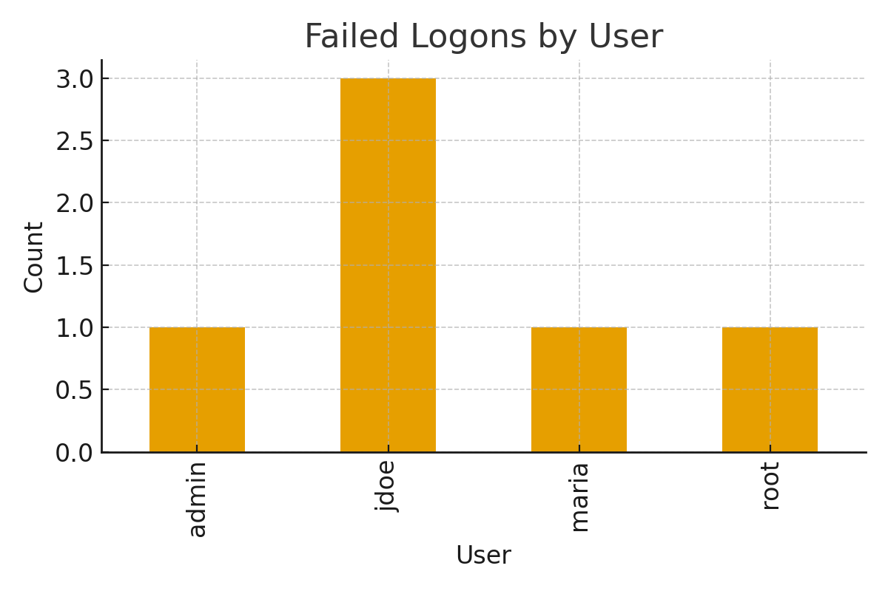

# SIEM Cyber Analytics Dashboard
### Python • Security Log Analysis • KRI Reporting • Cyber Risk Analytics

This project simulates real-world SIEM (Security Information & Event Management) analysis by ingesting Windows authentication logs, detecting anomalies, and generating KRI (Key Risk Indicator) visualizations for cyber risk reporting.

It demonstrates the practical skills used in SOC, cybersecurity analytics, and cyber risk reporting roles.

---

## 🔍 1. Objective

The purpose of this project is to:
- Parse raw security event logs
- Detect suspicious authentication activity
- Identify failed logon patterns
- Highlight abnormal user/IP behavior
- Generate KRIs for executive-level cyber reporting

---

## 🧩 2. Dataset

**logs.csv** contains Windows-style event activity:
- Timestamp  
- Host machine  
- Event ID  
- Username  
- Status (SUCCESS / FAILED)  
- Source IP  

This dataset was analyzed using Python (Pandas + Matplotlib).

---

## 🛠 3. Python Analysis Workflow

Notebook: **`siem_log_analysis.ipynb`**

### Key steps:
✔ Load and clean log data  
✔ Convert timestamps  
✔ Extract dates and hours  
✔ Identify failed logons  
✔ Group anomalies by user  
✔ Export cleaned CSVs for reporting  
✔ Generate visual KRI using Matplotlib  

Output files:
- `failed_logons_export.csv`
- `cleaned_logs_export.csv`
- `failed_logons_chart.png`

---

## 📊 4. Visualization (KRI)

Below is the generated KRI chart used to communicate risk to leadership:

This visualization highlights which accounts experience the highest authentication failures—an important indicator of:

- Password spray attempts  
- Misconfigured systems  
- Credential stuffing  
- Unauthorized access attempts  

---

## 📈 5. Summary of Findings

- **“jdoe” had the highest failed logon attempts (3)**  
- Failed attempts were also detected in **admin**, **maria**, and **root** accounts  
- An external IP (`203.0.113.12`) attempted logins against a privileged user  
- Privileged accounts showing failures represent elevated risk  
- Activity patterns are consistent with early brute-force probing  

These patterns would typically trigger further investigation in a SOC environment.

---

## 🎯 6. Skills Demonstrated

- SIEM-style log parsing  
- Cyber threat detection  
- Python analytics (Pandas)  
- Visualization (Matplotlib)  
- KRI report creation  
- Security monitoring fundamentals  
- Data cleaning + enrichment  
- Incident pattern recognition  

---
